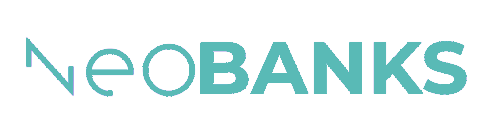

 

  
  
  
 

<!-- PROJECT LOGO -->
 

  

  <h3 align="center">NeoBanks - React Dashboard - Nuwe & CaixaBank Hackathon</h3>

  

    Proyecto desarrollado el 28/05/2022 para la hackathon de Caixabank Tech
     
     
    <a href="https://neobanks-react.netlify.app/">Ver Demo (Netlify)</a>
    ·
    <a href="mailto:contact@aglez.dev">Contacto</a>
  

<!-- TABLE OF CONTENTS -->

  
Contenidos

  <ol>
    <li>
      <a href="#about">Sobre el proyecto</a>
      <ul>
        <li><a href="#developed-with">Desarrollado con</a></li>
        <li><a href="#tech">¿Por qué esas tecnologías?</a></li>
      </ul>
    </li>
    <li><a href="#license">Licencia</a></li>
    <li><a href="#contact">Contacto</a></li>
    <li><a href="#acknowledgments">Agradecimientos</a></li>
  </ol>

<a name="about"/>

<!-- ABOUT THE PROJECT -->
## Sobre el proyecto
 

 

 
El reto consistía en implementar un Dashboard para la startup NeoBanks. Se debía realizar únicamente el frontend, usando datos de prueba.
El diseño que debía seguirse es el siguiente: <a href="https://www.figma.com/file/SxdHiAzQFC7oyBO0FeQGhh?node-id=502:2097">Enlace al Figma</a>

(<a href="#top">Volver arriba</a>)

<a name="developed-with"/>

### Desarrollado con:

Para llevar a cabo este proyecto, se ha hecho uso de las siguientes tecnologías:

* [React.js](https://reactjs.org/)
* [Typescript](https://www.typescriptlang.org/)
* [Vite](https://vitejs.dev/)
* [Chakra-UI](https://chakra-ui.com/)
* [Bootstrap Grid](https://getbootstrap.com)
* [Recharts](https://recharts.org/en-US/)

(<a href="#top">Volver arriba</a>)

<a name="tech"/>

### ¿Por qué esas tecnologías?

#### React
Framework de JS requerido por la Hackathon para llevar a cabo el desafío. Debido a falta de experiencia con React Native y algunos problemas de dependencias, únicamente está la versión web. Sin embargo, es responsive y se puede utilizar en cualquier dispositivo.

#### Vite
Empaquetador de React en lugar de Webpack. Acelera enormemente el proceso de desarrollo al reducir al mínimo los tiempos de inicio del servidor y de build.

#### Typescript
Al estar trabajando con datos que vendrán desde una API, es importante asegurarse que se reciben en el formato que se espera. Por eso, el tipado de typescript ayuda a evitar problemas en tiempo de ejecución.

#### Chakra-UI
Framework sencillo y minimalista para estilizar el proyecto. 

#### Bootstrap Grid
El sistema de grid de Bootstrap es bastante más flexible que el de Chakra, por lo que únicamente se ha instalado esta parte de la hoja css de bootstrap.

(<a href="#top">Volver arriba</a>)

<a name="licence"/>

<!-- LICENSE -->
## Licencia

Distribuido con la licencia MIT (open source). Leer `LICENSE.txt` para más información.

(<a href="#top">Volver arriba</a>)

<a name="contact"/>

<!-- CONTACT -->
## Contacto

Adrián González - [@aglezdev](https://twitter.com/aglezdev) - contact@aglez.dev

Portfolio: [aglez.dev](https://aglez.dev)

(<a href="#top">Volver arriba</a>)

<a name="acknowledgments"/>

<!-- ACKNOWLEDGMENTS -->
## Agradecimientos

* CaixaBank Tech
* Nuwe

(<a href="#top">Volver arriba</a>)

